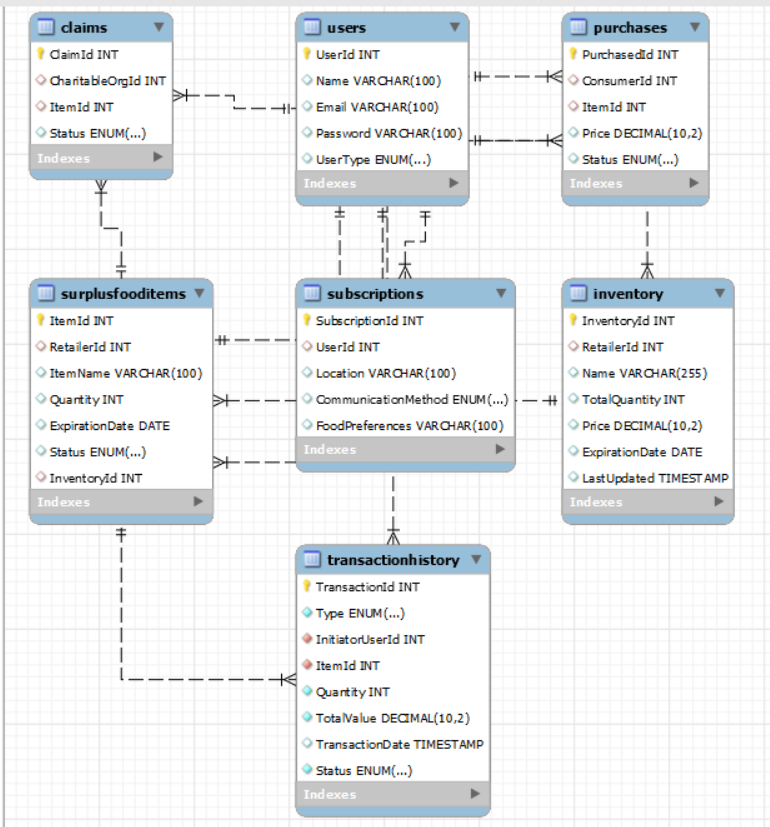

# CST8288 - W24

# FINAL PROJECT (022)

# Food Waste Reduction Platform 🌍

- **Arshpreet Kaur** - 041100889

# Table of Contents

## Project Overview
- [Version History](#version-history)
- [Introduction](#introduction)
- [Targeted Audience](#targeted-audience)
- [Scope](#scope)
  - [In Scope](#41-in-scope)
  - [Out of Scope](#42-out-scope)

## System Architecture
- [Application Architecture](#application-architecture)
  - [Presentation Layer](#51-presentation-layer)
  - [Layer of Business](#52-layer-of-business)
  - [Layer of Database](#53-layer-of-database)
- [Business Architecture](#business-architecture)
  - [Login and Registration](#61-login-and-registration)
  - [Inventory Use Case](#62-inventory-use-case)
  - [Retail Sales Use Case](#63-retail-sales-use-case)
  - [Charitable Organization Use Case](#64-charitable-organization-use-case)
  - [Surplus Food Alert Use Case](#65-surplus-food-alert-use-case)
  - [Bonus Functionality](#66-bonus-functionality)
- [Detailed Design](#detailed-design)
  - [Class Diagram](#71-class-diagram)

## Data Architecture
- [Architecture Explanation](#81-architecture-explanation)
- [Entities and Their Attributes](#82-entities-and-their-attributes)
- [Relationships](#83-relationships)

## Security
- [Security Architecture](#security-architecture)
  - [User Authentication](#91-user-authentication)
  - [User Authorization](#92-user-authorization)
  - [Data Encryption](#93-data-encryption)
  - [Data Protection](#94-data-protection)

## Deployment
- [Deployment Architecture](#deployment-architecture)
  - [Infrastructure Components](#101-infrastructure-components)
  - [Technologies Used](#102-technologies-used)
  - [Deployment Process](#103-deployment-process)
  - [Scaling Strategy](#104-scaling-strategy)

## Testing
- [Testing Model](#testing-model)
  - [Unit Testing (JUnit)](#111-unit-testing-junit)
  - [Integration Testing](#112-integration-testing)

## Other
- [Acronyms/Abbreviations](#acronymsabbreviation)

# Version History

| Version\#  | Authorized By         | Date        |
|------------|-----------------------|-------------|
| 1.0        | Arshpreet Kaur        | 22-03-2024  |

# Introduction

This report offers an in-depth examination of the Food Waste Reduction Platform. Its purpose is to provide a detailed insight into the platform's architecture, functionalities, and implementation considerations. It outlines the targeted audience, scope, and key components of the platform, highlighting its significance in addressing the global issue of food waste. Through this report, readers will gain valuable insights into the design, development, and deployment of the platform, as well as its potential impact on sustainability and hunger reduction.

# Targeted Audience

Project Stakeholders: Individuals or groups interested in the Food Waste Reduction Platform's success and outcomes.

Developers: Software engineers, programmers, and technical specialists responsible for implementation, coding, and maintenance.

Designers: UX designers, UI designers, and graphic designers involved in creating visual and interactive features.

Evaluators: QA testers, system analysts, and evaluators tasked with reviewing functionality, performance, and usability.

# Scope

## 4.1 In scope

1\. User Registration and Authentication: Users have the option to swiftly create accounts and securely log in.

2\. Retailer Inventory Management: Retailers are enabled to monitor their food inventory by adding new items or adjusting quantities.

3\. Identification of Surplus Food: Stores are empowered to designate surplus food they no longer require.

4\. Claiming Food Items for Charitable Organizations: To assist people in need, charities can use the additional food that retailers mention.

5\. Updating Inventory: The inventory list in the store is automatically updated when an item is taken or purchased.

## 4.2 Out Scope

1\. Payment Processing: We will not accept real money transactions for purchases.

2\. Advanced Analytics and Reporting: No fancy data analysis features are available.

3\. Supply Chain Management: Our primary focus is not on shipment tracking or supplier management.
   
4\. Regulatory Compliance: While we will cover fundamental security, this project will not provide specific legal information.

# Application Architecture

## 5.1 Presentation Layer

The presentation layer of our food waste reduction technology is the user-facing interface that retailers, organisations, and consumers can access. It is made up of online and mobile pages with easy-to-use interaction and navigation. Our primary goal is to create an intuitive user interface that facilitates the listing of extra food items, contribution claims, and purchase transactions.

## 5.2 Layer of Business

Our platform's core functions, including inventory management, transaction processing, and user authentication, are handled by the business layer. It ensures that business rules are uniformly applied across the platform, supporting essential operations like tracking down extra food items, managing stakeholder transactions, and updating inventory.

## 

## 5.3 Layer of Database

As the backbone of the platform, our data layer controls the archiving and retrieval of user, inventory, and transactional data. It is designed to guarantee data integrity, consistency, and security and supports essential operations including inventory management, transaction tracking, and user profile management.

# Business Architecture

## 6.1 Login and registration

This use case diagram outlines the processes for "Login" and "Registration" on the Food Waste Reduction Platform. Here's an explanation of each part:

Login Use Case:

1\. Login: This is the main action that a user begins with when they want to access their account.

2\. Enter Username/Password: This step is included in the "Login" use case and represents the user providing their credentials to the system.

3\. Validate Information: Another step included in the "Login" process where the system checks if the provided username and password are correct and match an existing user in the database.

4\. Grant Access: If the validation is successful, the user is granted access to the system. This is the final step in the login process.

Registration Use Case:

1\. Enter Username/Password: Just as in the login use case, the user starts by entering a chosen username and password.

2\. Choose User Type: After providing the initial credentials, the user selects what type of user they are (e.g., Retailer, Consumer, Charitable Organization). This categorization is crucial for defining the user's role and permissions within the platform.

3\. Validate Information: Like the login use case, the information entered during the registration process is validated. This likely includes checks for data format, uniqueness of the username/email, and possibly password strength.

4\. Save User Data: Upon successful validation, the user's data is saved to the system, creating a new user account.

Overall, the diagram provides a high-level overview of the steps involved in user authentication and account creation on the platform.

## 6.2 Inventory Use Case

The use case diagram depicts the functionality within the Inventory Management System for the Food Waste Reduction Platform. Here's a brief explanation:

1\. Inventory: This likely represents the system that is the focal point for managing inventory-related activities. It is the main functional area being described.

2\. Add new items: This use case represents the functionality that allows users (likely retailers) to add new food items to the inventory.

3\. Update Quantities: This use case enables users to modify the quantity of existing food items in the inventory.

4\. Set Expiration Date: A specific use case where users can set or update the expiration dates for food items in the inventory. This is crucial for tracking and managing perishable goods.

5\. List Surplus Items: This use case involves the functionality to list items that are determined to be surplus so that they can be sold at a discounted rate or donated.

6\. Identify Surplus Food: It is linked with an \<\<extends\>\> relationship to "List Surplus Items". This relationship suggests that identifying surplus food is an additional action that extends the basic "List Surplus Items" functionality.

## 6.3 Retail Sales Use Case

The use case diagram for a Retail Sales System within the Food Waste Reduction Platform outlines the interactions between the system and its users for the sales process. Here's a breakdown of the diagram:

1\. Browse Items: This use case represents the user's ability to look through the items available for sale. It is a fundamental step in any retail system, allowing users to find products they might want to purchase.

2\. Purchase Items: Once a user has found an item they wish to buy, this use case covers the process of making a purchase. The "Purchase Items" use case includes the "Browse Items" use case, suggesting that browsing is a necessary part of the purchasing process.

3\. Update Inventory: This use case is likely included after a purchase is made to reflect the change in inventory levels. It is an included step in the purchase process, indicating that when a purchase is made, the inventory must be updated accordingly to maintain accurate stock levels.

4\. Transaction Details: This use case relates to an "extends" relationship to the "Purchase Items" use case. This suggests that recording the transaction details is an additional step that doesn't always occur as part of the standard purchase flow but may be initiated under certain conditions, such as when detailed receipts are requested, or for high-value transactions where more information is needed.

In summary, this diagram is detailing the steps involved when a customer interacts with the retail sales system to browse, purchase, and trigger inventory updates, as well as potentially provide detailed transaction records under certain circumstances.

## 6.4 Charitable Organization Use Case

The use case diagram titled "Food Waste Reduction Platform Charity Food Claim System" represents the process that a charitable organization would follow to claim food items. Here is a description of the use cases depicted:

1\. Claim Item: This is the central use case around which the other actions revolve. It represents the action of a charitable organization claiming items that retailers have listed as available for donation.

2\. List Food Items to be Claimed: This use case likely extends the "Claim Item" process. It represents the functionality where the charitable organization can view a list of food items available to be claimed.

3\. Update Inventory: This use case also extends the "Claim Item" action. It represents the system's process of updating inventory levels once an item has been claimed.

4\. Claimed Items List: This extends the "Claim Item" use case too. It suggests that after claiming an item, there's an option to review a list of all items that have been claimed. This might be used for record-keeping or reporting purposes within the charitable organization.

## 6.5 Surplus Food Alert Use Case

The use case diagram illustrates the Surplus Food Management System's notification subsystem within the Food Waste Reduction Platform. The diagram describes how users interact with the system to receive notifications about surplus food. Here's a breakdown of each use case:

1\. User Subscription: This is likely the initial use case where users can subscribe to receive notifications. It forms the basis for the other actions related to notification settings.

2\. Notification Alerts: Central to this diagram, it represents the system's capability to send out alerts to users. This use case includes several other use cases, meaning it requires the information from these to send notifications effectively.

3\. Location: This included use case suggests that users can specify their location preferences for receiving alerts about surplus food nearby.

4\. Phone/Email: Another included use case indicating that users can choose their preferred method of communication, such as phone or email, to receive alerts.

5\. Food Preferences: This use case, which is also included, implies that users can set specific food preferences for the alerts they want to receive, such as types of food or dietary restrictions.

6\. Surplus Food List: While it's not directly connected to "Notification Alerts," this use case is likely a central feature of the system where the list of surplus food is managed and maintained.

## 6.6 Bonus Functionality

A bonus feature is that Consumer and Charitable Organization are able to give feedback to the retailer and the retailer is able to view them through the view feedback tab.

# Detailed Design

When we're building software, it's important to map out how everything fits together. That's where detailed design comes in. It's like creating a blueprint for a house before you start building it. One essential part of detailed design is making UML diagrams. These diagrams help us see the big picture of our software by showing us the different parts and how they connect.

In this section, we'll focus on one type of UML diagram called the class diagram. Think of it as a map that shows all the classes in our software, what they do, and how they're related.

## 7.1 Class diagram

**UserDTO Class:**

-   Represents user data with attributes UserID, UserType, Email, Username, Password, and IsSubed.
-   Provides methods for accessing and updating user information.
-   Facilitates structured management of user data within the system.

**Retailer Class:**

-   Represents a retailer entity with attributes RetailerID, Name, Address, and InventoryDAO.
-   Provides methods for listing food items and updating inventory.
-   Manages inventory and facilitates operations related to food items within the system.

**CharitableOrganization Class:**

-   Represents a charitable organization with attributes OrganizationID, Name, Address, and ContactInfo.
-   Offers methods for claiming food items and updating their claim status.
-   Manages interactions related to food donations within the system.

**UserBusinessLogic Class:**

-   Manages user-related business logic within the system.
-   Utilizes UserDAOImpl for data access operations.
-   Provides methods for retrieving all users and adding new users.

**NotificationService Class:**

-   Handles notifications within the system, identified by NotificationID.
-   Manages a list of UserSubscriptions for subscribers.
-   Offers methods for sending notifications, registering subscribers, and removing subscribers.

**UserSubscription Class:**

-   Represents a user's subscription within the system, identified by SubscriptionID.
-   Includes attributes for UserID, Preferences, and NotificationMethod.
-   Provides methods for subscribing and unsubscribing from notifications.

**ValidationException Class:**

-   Represents an exception related to validation errors in the system.
-   Provides constructors for creating ValidationException instances with optional error messages and throwable causes.

**Validator Class:**

-   Performs validation checks for user data within the system.
-   Includes constants USERNAME_LENGTH and PASSWORD_LENGTH for defining username and password length requirements.
-   Offers methods for validating a user's overall data, username, and password individually.

**UserDAOImpl Class**:

-   Implements data access operations for managing user data in the system.
-   Utilizes attributes connect, prepare, and result for database connections and operations.
-   Provides methods for retrieving all users, getting a user by ID, inserting, deleting, and updating users, and checking if a user exists.

**Claim Class:**

-   Represents a claim made by a charitable organization for a food item, identified by ClaimID.
-   Includes attributes for OrganizationID, ClaimDate, and Status.
-   Provides a method for confirming a claim, indicating the acceptance of a food item by the organization.

**Purchase Class:**

-   Represents a purchase made by a consumer, identified by PurchaseID.
-   Includes attributes for ConsumerID, PurchaseDate, FoodItems (mapping FoodItem to quantity), and TotalAmount.
-   Offers a method for completing the purchase transaction.

**Transaction Class:**

-   Represents a transaction within the system, identified by TransactionID.
-   Includes attributes for PurchaseID, ConsumerID, ItemID, Price, and Status.
-   Status is represented by an enum indicating whether the transaction is pending or completed.

**Consumer Class:**

-   Represents a consumer in the system, identified by ConsumerID.
-   Includes attributes for Name and PaymentInfo.
-   Provides methods for adding items to the shopping cart and completing purchases.

**LoginValidation Class:**

-   Handles login validation within the system.
-   Provides a method handleLogin() for validating login requests using HttpServiceRequest and HttpServletResponse objects.
-   isValid attribute indicates the validity of the login request.

**DatabaseConnection Class:**

-   Manages database connections within the system.
-   Attributes include connection (of type Connection), driverString (String), and instance (DataSource).
-   Offers methods for retrieving a DataSource instance and obtaining a Connection object for database operations.

**InventoryBusinessLogic Class:**

-   Handles inventory-related business logic within the system.
-   Utilizes InventoryDAOImpl for data access operations.
-   Provides methods for retrieving all food items and adding new items to the inventory.

**InventoryDTO Class:**

-   Represents inventory data for food items within the system.
-   Attributes include FoodID, FoodName, FoodAmount, Price, ExpirationDate, and SurplusType.
-   Provides getters and setters for each attribute to access and modify inventory information.

**InventoryDAOImpl Class:**

-   Implements data access operations for managing inventory data in the system.
-   Utilizes attributes connect, prepare, and result for database connections and operations.
-   Provides methods for retrieving all food items, getting a food item by ID, inserting, deleting, and updating food items in the inventory.

**InventoryDAO Class:**

-   Manages data access operations for inventory data in the system.
-   Provides methods for retrieving all food items, getting a food item by ID, inserting, deleting, and updating food items in the inventory.

# Data Architecture

The Entity-Relationship Diagram (ERD) provided above shows the data architecture for the Food Waste Reduction Platform. It outlines the database structure, indicating how different entities within the system are related and the nature of these relationships.

## 8.1 Architecture Explanation

This ERD illustrates the data architecture of the platform, defining how various entities such as users, items, transactions, and subscriptions are organized and interrelated. The use of primary keys (PK) and foreign keys (FK) establishes relationships between entities, which are essential for database normalization and ensuring data integrity.

The architecture allows for tracking the lifecycle of food items from being stocked in inventory, identified as surplus, and then either claimed by charitable organizations or purchased by consumers. Transactions serve as a historical ledger for purchases, and subscriptions enable the system to target users with relevant alerts.

## 8.2 Entities and Their Attributes

The Entity-Relationship Diagram (ERD) comprises several interconnected entities that define how the platform manages and utilizes data. Here is an explanation of the data structure:

1.  Users- This table is at the core of the platform. It serves as the primary reference point for other entities that represent actions or attributes related to the users, like their purchases, claims, inventory, and subscriptions.
1.  Inventory- Inventory represents the stock of food items that retailers have available. This table is related to the Users table through the RetailerId, connecting each inventory item to its respective retailer. It includes information like quantity and price, which are crucial for managing the supply side of the platform.
1.  SurplusFoodItems- The SurplusFoodItems table captures information about food items that are in excess and need to be either sold or donated before they expire. It extends from the Inventory entity to highlight items that have become surplus. This entity also links back to the Users table, showing which retailer the surplus items belong to.
1.  Claims- This table records the actions of charitable organizations as they claim surplus items for donation purposes. It links to the Users table through the CharitableOrgId, indicating which organization made the claim. It also references the SurplusFoodItems through the ItemId, specifying which items are being claimed.
1.  Purchases- The Purchases table logs the transactions where consumers buy surplus items. It contains foreign keys to both the Users table (as ConsumerId) and the SurplusFoodItems table (as ItemId), establishing the connection between the consumer and the specific items they've purchased.
1.  Subscriptions- This entity manages the subscription details for users who wish to receive updates and notifications about surplus food availability. The UserId foreign key links subscriptions to the specific user in the Users table, while additional attributes like Location and FoodPreferences personalize the subscription service.
1.  TransactionHistory- The TransactionHistory table is a comprehensive record of all financial transactions on the platform, be they related to sales or claims. This table ties transactions back to the users through the InitiatorUserId and the specific items through the ItemId. It includes details such as transaction type, quantity, total value, and status.

## 8.3 Relationships

1\. Users to Inventory: One-to-Many, indicating that a retailer can manage multiple inventory items.

2\. Users to SurplusFoodItems: One-to-Many, showing that retailers list multiple surplus items.

3\. Users to Claims: One-to-Many, allowing charitable organizations to claim many surplus items.

4\. Users to Purchases: One-to-Many, consumers can have multiple purchase records.

5\. Users to Subscriptions: One-to-Many, users can subscribe to various types of notifications.

6\. Inventory to SurplusFoodItems: One-to-Many, depending on each inventory item can be listed multiple times as surplus.

7\. SurplusFoodItems to Claims: One-to-Many, a surplus item can have multiple claims.

8\. SurplusFoodItems to Purchases: One-to-Many, a surplus item can be purchased by multiple consumers.

9\. SurplusFoodItems to TransactionHistory: One-to-Many, each item can be involved in multiple transactions.

10\. Users to TransactionHistory: One-to-Many, a user can initiate multiple transactions.

# Security Architecture

Security considerations and measures implemented in the design.

## 9.1 User Authentication:

-   Implement a secure authentication mechanism using Servlets and JSP.
-   Users should be able to register with their name, email, password, and user type.
-   Use strong password hashing techniques for storing passwords securely.
-   Implement session management to handle user sessions securely.

## 9.2 User Authorization

-   Define roles for users (e.g., retailers, consumers, charitable organizations) and assign appropriate permissions.
-   Use role-based access control (RBAC) to enforce access restrictions based on user roles.
-   Ensure that sensitive functionalities are only accessible to authorized users based on their roles.

## 9.3 Data Encryption

-   Encrypt sensitive data such as passwords, user information, and financial transactions using HTTPS protocols.
-   Implement encryption algorithms for encrypting data at rest in the database.

## 9.4 Data Protection

-   Apply input validation and sanitization techniques to prevent SQL injection, XSS attacks, and other vulnerabilities.
-   Use parameterized queries with JDBC to mitigate SQL injection risks.
-   Implement access controls at the database layer to restrict direct access to sensitive data.

# Deployment Architecture

## 10.1 Infrastructure Components

-   Setup virtual machines or containers for hosting application components.
-   Use load balancers to distribute incoming traffic across multiple instances for improved performance and availability.

## 10.2 Technologies Used

-   Application Server: Apache Tomcat for deploying Java Servlets and JSP pages.
-   Database: MySQL for data storage and management.
-   Web Server: Apache HTTP Server for serving static content and proxying requests to Tomcat.

## 10.3 Deployment Process

-   Continuous Integration/Continuous Deployment (CI/CD) pipeline for automated build, test, and deployment processes.
-   Use version control systems like Git for managing codebase and versioning.
-   Deploy application artifacts to the Tomcat server using deployment scripts or tools like Jenkins.

## 10.4 Scaling Strategy

-   Horizontal scaling by adding more instances based on load using auto-scaling groups.
-   Vertical scaling by upgrading instance types for improved performance and resource allocation.

# Testing Model

## 11.1 Unit Testing (Junit)

-   Utilize JUnit for writing and executing unit tests for individual components such as Servlets, business logic classes, and data access objects.
-   Write test cases to validate the functionality of methods and classes in isolation.

## 11.2 Integration Testing

-   Test the interaction between different modules, such as user registration and inventory management, to ensure seamless integration.

# 

# Acronyms/Abbreviation

-   ERD - Entity-Relationship Diagram
-   PK - Primary Key
-   FK - Foreign Key
-   RBAC - Role-Based Access Control
-   XSS - Cross-Site Scripting
-   CI/CD - Continuous Integration/Continuous Deployment
-   AWS - Amazon Web Services
-   TLS - Transport Layer Security
-   HTTPS - Hypertext Transfer Protocol Secure
-   SQL - Structured Query Language
-   JDBC - Java Database Connectivity
-   SSL - Secure Sockets Layer
-   JSP - JavaServer Pages
-   UI - User Interface
-   UX - User Experience
-   QA - Quality Assurance
-   UML - Unified Modeling Language
-   DAO - Data Access Object
-   DTO - Data Transfer Object
-   HTTP - Hypertext Transfer Protocol
-   HTML - Hypertext Markup Language
-   CSS - Cascading Style Sheets
-   API - Application Programming Interface
-   URI - Uniform Resource Identifier
